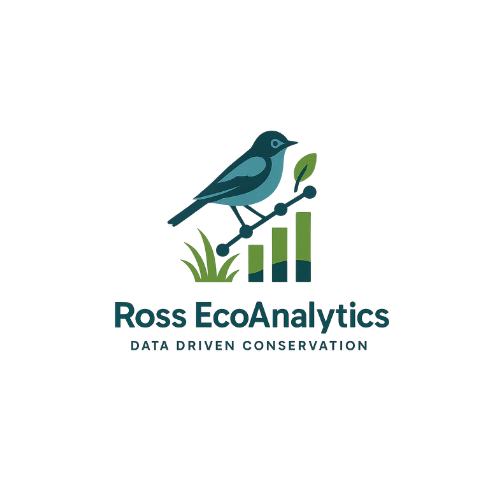

{style="float: left; margin-right: 10px;"  width="300px"}

## Data Driven Conservation

At Ross EcoAnalytics, we are committed to providing high-quality statistical analyses and data science services to organizations that align with our environmental values. By leveraging advanced analytics and visualization tools, we aim to support non-profits, research institutions, and state and federal partners in making data-informed decisions that drive conservation.

***

## Mission

Our mission is to shift the way ecologists manage wildlife, fish, and plant species. We specialize in cutting-edge, data-driven solutions that provide critical insights into conservation actions and decision making. With a pragmatic approach, we help wildlife professionals make informed decisions that benefit the planet while optimizing budgets.